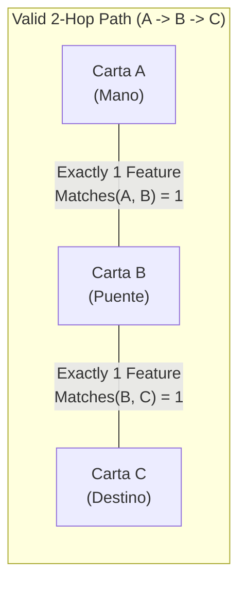

<div align="center">

# 🃏 Mundo Chiquito — Graph Triad Search Engine

**Combinatorial 2-hop pathfinder and graph similarity engine in Kotlin for constrained entity matching.**

Developed for **CI-2693: Algorithms and Data Structures III** at [Universidad Simón Bolívar (USB)](https://www.usb.ve/).

[](https://kotlinlang.org/)
[](https://openjdk.org/)
[](#algoritmo-y-complejidad-computacional)
[](#autores)

</div>

---

## 📌 Problem Formulation

In card game theory and combinatorial search, the **"Mundo Chiquito"** (Small World) problem requires discovering all valid triads of entities $(A, B, C)$ where:
1. Card $A$ (in hand) can bridge to Card $B$ (bridge in deck) if and only if they share **exactly one** identical attribute among:
   - **Level:** $1 \le \text{Level} \le 12$
   - **Power (ATK):** Integer multiple of 50
   - **Attribute:** One of `["AGUA", "FUEGO", "VIENTO", "TIERRA", "LUZ", "OSCURIDAD", "DIVINO"]`
2. Card $B$ bridges to target Card $C$ under the exact same constraint: sharing **strictly one** feature.
3. Card $A$ and Card $C$ must be distinct, and symmetric permutations (e.g., $C \rightarrow B \rightarrow A$ vs. $A \rightarrow B \rightarrow C$) must be deduplicated.

---

## 🏛️ Graph-Theoretic Modeling

We model the deck as an undirected graph $G = (V, E)$:
- **Vertices ($V$):** Each card parsed from `deck.csv` is an instance of `CartaMostro`.
- **Edges ($E$):** An undirected edge $(u, v) \in E$ exists if and only if:
  $$\text{Matches}(u, v) = \mathbb{I}(L_u = L_v) + \mathbb{I}(P_u = P_v) + \mathbb{I}(Attr_u = Attr_v) = 1$$



---

## ⚡ Algorithm & Computational Complexity

```
1. Parse deck.csv into Card entities V with defensive validation
2. Initialize Adjacency List Grafo[|V|]
3. FOR i = 0 TO |V|-1:
4.     FOR j = i+1 TO |V|-1:
5.         IF Matches(V[i], V[j]) == 1:
6.             Add undirected edge (i, j)
7. FOR i = 0 TO |V|-1:
8.     FOR j IN Grafo[i]:
9.         FOR k IN Grafo[j]:
10.            IF i < k:  // Symmetry breaking
11.                Output (V[i], V[j], V[k])
```

### Complexity Analysis
- **Graph Construction:** $\mathcal{O}(V^2)$ where $V = |Deck|$. Evaluates pairwise compatibility for all $\binom{V}{2}$ combinations.
- **Path Search (2-Hop Walk):** Upper bounded by $\mathcal{O}(V \cdot \Delta^2)$ where $\Delta$ is the maximum degree of the graph. In sparse similarity graphs, execution finishes in sub-millisecond time.
- **Symmetry Deduplication:** The index guard $i < k$ reduces traversal overhead by $50\%$ and eliminates redundant mirrored triads.

---

## 🛠️ Compilation & Execution

### Prerequisites
- Java JDK 11 or higher.
- Kotlin Compiler (`kotlinc`).

### Building from Source
```bash
# Clone the repository
git clone https://github.com/soyvistorrr/proyecto2-algos.git
cd proyecto2-algos

# Compile sources into standalone runnable JAR
kotlinc MundoChiquito.kt CartaMostro.kt -include-runtime -d MundoChiquito.jar

# Run the search engine
java -jar MundoChiquito.jar
```

### Input Data Format (`deck.csv`)
The engine reads from `deck.csv` in the root folder:
```csv
Nombre, Nivel, Atributo, Poder
Mago Oscuro, 7, OSCURIDAD, 2500
Chica Maga Oscura, 6, OSCURIDAD, 2000
Dragon Blanco de Ojos Azules, 8, LUZ, 3000
Kuriboh, 1, OSCURIDAD, 300
```

---

## 👥 Authors
- **Victor Hernández** ([@soyvistorrr](https://github.com/soyvistorrr))
- **Daniela Gragirena** ([@DanielaGragirena](https://github.com/DanielaGragirena))

Universidad Simón Bolívar, Caracas, Venezuela.
